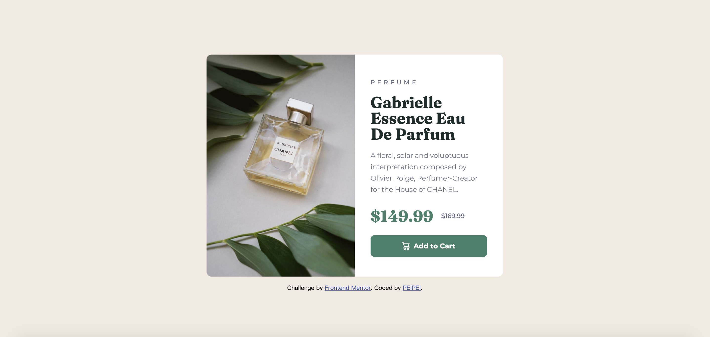

# Product Preview Card Component 

This project is a Responsive Web Design of a Product Preview Card built with HTML and CSS.

## Table of contents

- [Overview](#overview)
  - [The challenge](#the-challenge)
  - [Screenshot](#screenshot)
- [My process](#my-process)
  - [Built with](#built-with)
  - [What I learned](#what-i-learned)
  - [Continued development](#continued-development)
  - [Useful resources](#useful-resources)
- [Acknowledgments](#acknowledgments)

## Overview

### The challenge

Users should be able to:

- View the optimal layout depending on their device's screen size
- See hover and focus states for interactive elements

### Screenshot



## My process

### Built with

- Semantic HTML5 markup
- CSS custom properties
- Flexbox
- Mobile-first workflow

### What I learned

One can switch image at different screen width without Javascript DOM by using picture tag and srcset. 

Following is an example from the project index.html.
In this way, when the screen width exceeds over 860px, the image will switch to image-product-desktop.jpg.

```html
<div class="col-img">
        <picture>
          <source media="(min-width: 860px)" srcset="./images/image-product-desktop.jpg" alt="perfume-chanel">
          
        </picture>
      </div>
```

However, since source-tag doesn't support class as an attribute. I had a hard time figuring out how to change the image border radius in media query in css.
Found out that changing the border radius on the original img tag ('product-img' class) could achieve the ideal result.

Following is an example of how I set the border-radius of product-img in media query.

```css
.product-img {
    border-top-right-radius: 0px;
    border-bottom-left-radius: 10px;
  }
```

### Continued development

- Use background-img in CSS to switch img at different screen width
Even though I solved the switch image problem with picture tag and srcset. I figured it would be much simpler if I used background-img.
- Feedback Welcome
I'm still thinking of a better solution for this project. Any advice or feedback is welcomed!

### Useful resources

- [Normalize CSS](https://necolas.github.io/normalize.css/)
- [Six-Minutes.Smarter: Display Different Images Based on Device Width](https://youtu.be/nHB-3WJTfSg) - Learn how to use the picture tag & srcset 

## Acknowledgments

### Frontend Mentor - Product preview card component solution

This is a solution to the [Product preview card component challenge on Frontend Mentor](https://www.frontendmentor.io/challenges/product-preview-card-component-GO7UmttRfa). 
